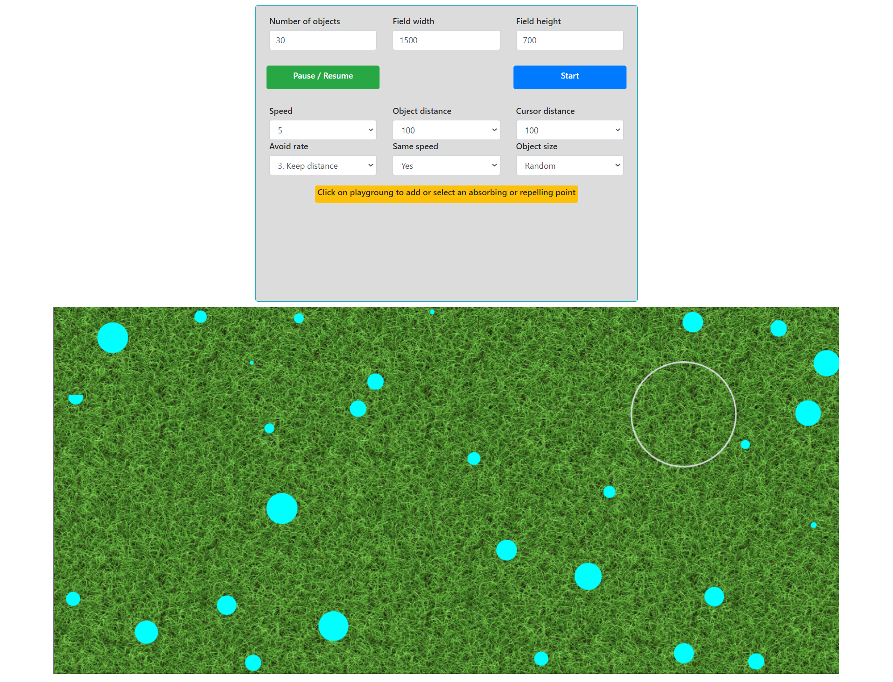

# Game
### Web application game

This is a web application game that there are some objects in the playground that are moving around by random, but they have to keep the distance between each other and also from the cursor of the mouse. The bootstrap is used in html, and the application is written with Typescript and the relative javascript file is provided in the repository.

I invested around 18-22 hours to write the game, improve the code and the user interface, and to test the game. This game was not a very challenging programming task. However, it was necessary to invest enough time to manage the object movements, improve the user interface, and to add some extra features and options to the game.

To run the game, simply download the repository to your machine and open the index.html file using a web browser (Google Chrome, Mozilla Firefox, Microsoft Edge are tested).

## Game settings:

"Number of objects": The number of objects can be entered here. It is 10 by default.
"Field width", "Field height": The width and height of the playground can be set using these inputs. Default values are Field width: 2000, and Field height: 800. 

After setting the "Number of objects", "Field width" and "Field height", click the start button to start the game.
#### NB: In case of changing these settings during the game, the start button should be clicked to apply the new settings. However, the changes in other settings will be applied during the game. 

"Pause / Resume" button is to pause the object movements and resume them.

Speed: The movement speed of the objects can be chosen using speed dropdown.

Object distance: It is the distance that the objects should keep it from other objects.

Cursor distance: It is the distance that the objects should keep it from cursor of the mouse.

Avoid rate: It is the rate of keeping the distance. The range of the rate is from 1 to 5. If the rate is 1, it means that the object will try to keep the distance, but not strictly at all. And the can get closer to each other sometimes. If the rate is 5, it means that the object will keep the distance very strictly.

Same speed: This is an option to make the speed of the objects equal and constant. If yes is selected, all objects will move with the same and constant speed. Otherwise, their speeds can vary from each other.

Object size: The size of the objects can be selected using this option. The values are the radius of the objects. Also, it can be chosen to generate random object sizes.

In addition to the above-mentioned rules, you can add some fixed points in the playground that can be set to absorb the other objects or repel them. To do so, please click on the playground. This will add a point to the playground. By adding a point, some other settings will appear.

To select a previously added point, simply click on the point. Then the settings of the selected point will be displayed in the control panel. (Selected point will be shown with a thin grey color border)

point settings:
Point size: The size of the point can be chosen using this option.

Type: The type of point can be selected here. It can be rather "absorbing point" or "repelling point".
An absorbing point will absorb the other objects that are in its effective range, and the repelling point will repel the other objects that are in its effective range.

Effect rate: The absorb or repel power of the point can be chosen using this option.
#### NB: If point type is absorbing, and the power rate is the same or bigger than the avoid rate of the objects, the objects may even have contact with each other.

Effect range: This option shows the effective range of the absorbing or repelling point. This is in the same unit with "Object distance" and "Cursor distance" options.

Delete point button: This button will remove the selected absorbing or repelling point from the playground.

#### NB:  If you keep the mouse cursor on an absorbing point or close to it, the point will not be able to absorb the other objects because keeping the distance from the mouse is more important than anything else in the game.

  

